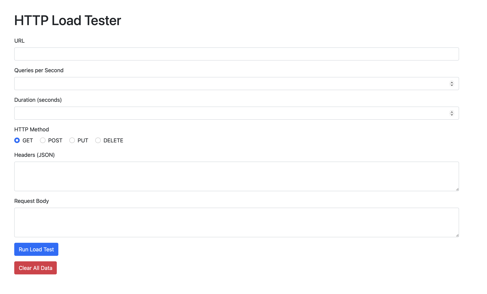
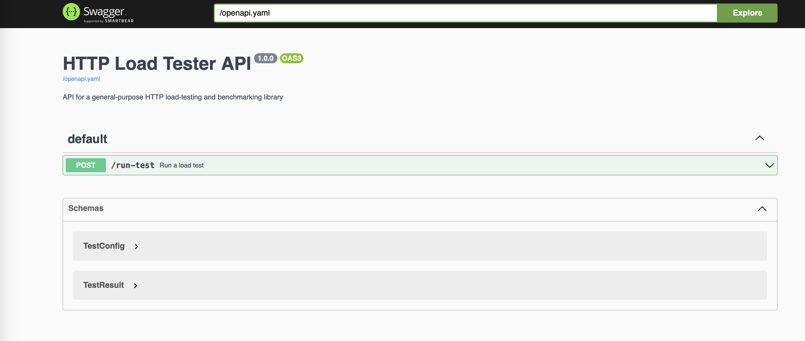
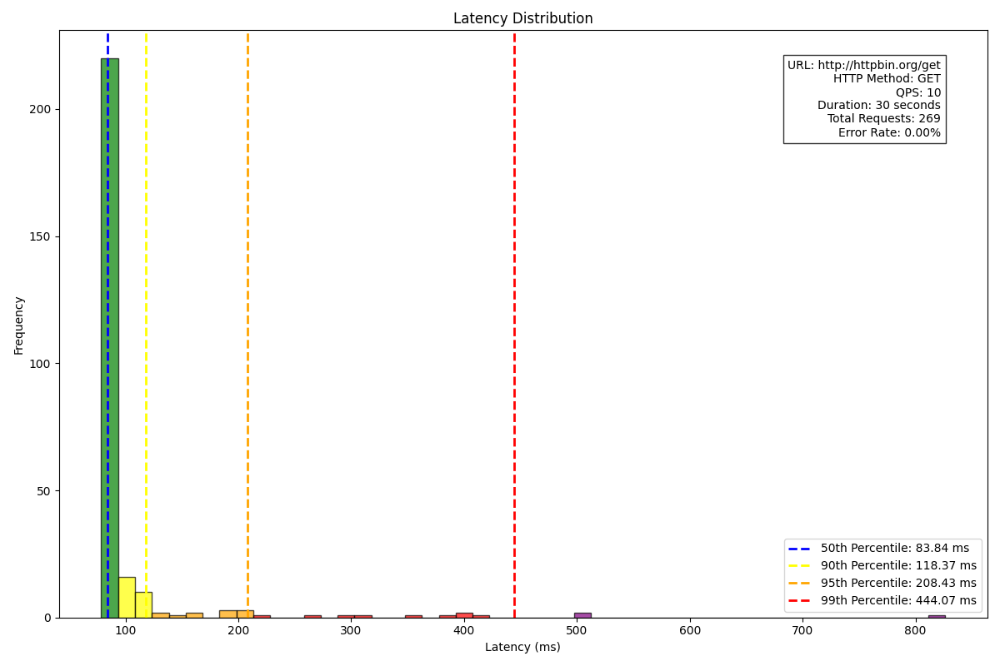
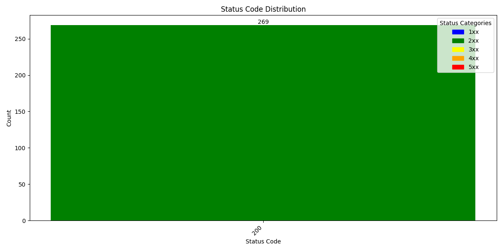

# HTTP Load Tester

## Table of Contents
1. [Introduction](#introduction)
2. [Features](#features)
3. [Project Structure](#project-structure)
4. [Requirements](#requirements)
5. [Installation](#installation)
6. [Usage](#usage)
   - [Running Locally](#running-locally)
   - [Running with Docker](#running-with-docker)
   - [Web Interface](#web-interface)
   - [Command Line Interface](#command-line-interface)
   - [API](#api)
7. [Configuration](#configuration)
8. [Endpoints](#endpoints)
9. [Example Output](#example-output)
10. [API Documentation](#api-documentation)
11. [Testing](#testing)
    - [Unit Tests](#unit-tests)
    - [Testing Endpoints](#testing-endpoints)
12. [Implementation Details](#implementation-details)

## Introduction

HTTP Load Tester is a versatile HTTP load-testing and benchmarking tool with a web interface, API, and command-line capabilities. It allows you to simulate high loads on web servers, RESTful APIs, and other HTTP-based services, providing valuable insights into performance under various conditions.

## Features

- Web-based user interface for easy test configuration and result visualization
- Configurable QPS (queries per second) for precise control over load intensity
- Support for various HTTP methods (GET, POST, PUT, DELETE, etc.)
- Custom headers and request body for flexibility in request configuration
- Detailed latency and error rate reporting for comprehensive performance analysis
- Visualization of results through latency distribution and status code charts
- RESTful API for easy integration with other tools and services
- Command-line interface for script-based testing
- Docker support for simple deployment and scalability

## Project Structure

```
http-load-tester/
│
├── src/
│   ├── http_load_tester.py
│   └── api.py
│   └── __init__.py
│
├── templates/
│   └── index.html
│
├── tests/
│   └── test_http_load_tester.py
│
├── docs/
│   └── openapi.yaml
│
├── Dockerfile
├── requirements.txt
├── README.md
└── .gitignore
```

## Requirements

- Python 3.9+
- aiohttp
- matplotlib
- Flask
- PyYAML

## Installation

1. Clone the repository:
   ```
   git clone https://github.com/yourusername/http-load-tester.git
   cd http-load-tester
   ```

2. (Optional) Create and activate a virtual environment:
   ```
   python -m venv venv
   source venv/bin/activate  # On Windows, use `venv\Scripts\activate`
   ```

3. Install dependencies:
   ```
   pip install -r requirements.txt
   ```

## Usage

### Running Locally

1. Navigate to the project directory.
2. Run the API server:
   ```
   python src/api.py
   ```
3. The server will start on `http://localhost:5001` by default.

### Running with Docker

1. Build the Docker image:
   ```
   docker build -t http-load-tester .
   ```
2. Run the container:
   ```
   docker run -p 5001:5001 http-load-tester
   ```
3. The server will be accessible at `http://localhost:5001`.

### Web Interface

1. Open a web browser and navigate to `http://localhost:5001`.
2. Use the form to configure and run your load test.
3. View results and generated plots on the same page.

### Web Interface Usage

The HTTP Load Tester provides a user-friendly web interface for configuring and running load tests. To access it:

1. Start the application (either directly or via Docker).
2. Open a web browser and navigate to `http://localhost:5001`.
3. You'll see a form like this:



Fill in the fields as follows:

- URL: The target URL for your load test (e.g., https://httpbin.org/get)
- Queries per Second: Number of requests to send per second (e.g., 10)
- Duration (seconds): How long to run the test (e.g., 30)
- HTTP Method: Choose GET, POST, PUT, or DELETE
- Headers (JSON): Any custom headers in JSON format (e.g., {"User-Agent": "HTTPLoadTester/1.0"})
- Request Body: Any data to send with the request (leave blank for GET requests)

4. Click "Run Load Test" to start the test.
5. Results will be displayed below the form once the test is complete.

## Configuration

The load tester can be configured using the web interface, command-line arguments, or through the API payload. Key configuration options include:

- `url`: Target URL for the load test
- `qps`: Queries per second
- `duration`: Test duration in seconds
- `method`: HTTP method
- `headers`: Custom HTTP headers
- `data`: Request body data
- `concurrency`: Maximum number of concurrent requests
- 
### Command Line Interface

To run a load test directly from the command line:

```
python src/http_load_tester.py <url> [options]
```

Options:
- `--qps`: Queries per second (default: 10)
- `--duration`: Test duration in seconds (default: 60)
- `--method`: HTTP method (default: GET)
- `--headers`: JSON string of headers
- `--data`: Request body data
- `--concurrency`: Maximum number of concurrent requests (default: 100)

Example:
```
python src/http_load_tester.py https://api.example.com --qps 100 --duration 300 --method POST --headers '{"Content-Type": "application/json"}' --data '{"key": "value"}'
```

### API

The `/run-test` endpoint only accepts POST requests. To use the API:

1. Ensure the server is running (either locally or in Docker).
2. Send a POST request to `http://localhost:5001/run-test` with a JSON body containing the test configuration:

   ```json
   {
     "url": "https://httpbin.org/get",
     "qps": 10,
     "duration": 30,
     "method": "POST",
     "headers": {
       "User-Agent": "HTTPLoadTester/1.0"
     },
   
     "data": "{\"key\": \"value\"}"
   }
   ```

curl command will look like 

```
curl -X POST http://localhost:5001/run-test \
  -H "Content-Type: application/json" \
  -d '{
    "url": "https://httpbin.org/post",
    "qps": 5,
    "duration": 10,
    "method": "POST",
    "headers": {
      "User-Agent": "HTTPLoadTester/1.0"
    },
    "data": "{\"key\": \"value\"}"
  }'
```

3. The API will return a JSON response with the test results and links to the generated visualizations. The response will look similar to this:

   ```json
   {
     "results": {
       "total_requests": 300,
       "error_rate": 0.02,
       "avg_latency": 150.5,
       "median_latency": 120.3,
       "min_latency": 50.1,
       "max_latency": 500.7,
       "p50_latency": 120.3,
       "p90_latency": 250.6,
       "p95_latency": 300.2,
       "p99_latency": 450.8,
       "status_codes": {
         "200": 294,
         "404": 4,
         "500": 2
       }
     },
     "latency_plot": "/output/latency_distribution.png",
     "status_plot": "/output/status_code_distribution.png"
   }
   ```

   The `latency_plot` and `status_plot` fields contain relative URLs to the generated plot images. To access these images, prepend your server's base URL. For example, if your server is running on `http://localhost:5001`, the full URLs would be:
   
   - `http://localhost:5001/output/latency_distribution.png`
   - `http://localhost:5001/output/status_code_distribution.png`

Note: Accessing `http://localhost:5001/run-test` directly in a browser will result in a "Method Not Allowed" error, as browsers typically send GET requests. Use a tool like cURL, Postman, or a custom script to send POST requests to this endpoint.

4. Using Postman

   1. Open Postman and create a new request.
   2. Set the request type to POST.
   3. Enter the URL: `http://localhost:5000/run-test`
   4. Go to the "Headers" tab and add:
      - Key: `Content-Type`
      - Value: `application/json`
   5. Go to the "Body" tab, select "raw", and enter the following JSON:
      ```json
      {
        "url": "http://httpbin.org/get",
        "qps": 10,
        "duration": 30,
        "method": "GET",
        "headers": {"User-Agent": "HTTPLoadTester/1.0"},
        "concurrency": 50
      }
      ```
   6. Click "Send" to make the request.
   7. Examine the response body and status code to verify the API is working correctly.

## Configuration

The load tester can be configured using the web interface, command-line arguments, or through the API payload. Key configuration options include:

- `url`: Target URL for the load test
- `qps`: Queries per second
- `duration`: Test duration in seconds
- `method`: HTTP method
- `headers`: Custom HTTP headers
- `data`: Request body data
- `concurrency`: Maximum number of concurrent requests

## Endpoints

- Web UI: `http://localhost:5001/`
- API endpoint: `http://localhost:5001/run-test` (POST) - Use with Curl
- Swagger UI: `http://localhost:5001/docs`

- OpenAPI specification: `http://localhost:5001/openapi.yaml`
- Generated plots: 
  - `http://localhost:5001/output/latency_distribution.png`
  - `http://localhost:5001/output/status_code_distribution.png`

## Example Output

Here are example outputs from a load test run:

### Latency Distribution



This graph shows the distribution of response latencies:
- Green bars represent latencies below the 50th percentile
- Yellow bars represent latencies between the 50th and 90th percentiles
- Orange bars represent latencies between the 90th and 95th percentiles
- Red bars represent latencies between the 95th and 99th percentiles
- Purple bars represent latencies above the 99th percentile

The dashed lines indicate specific percentiles:
- Blue: 50th percentile (median)
- Yellow: 90th percentile
- Orange: 95th percentile
- Red: 99th percentile

The summary box in the top-right corner provides key information about the test run.

### Status Code Distribution



This graph shows the distribution of HTTP status codes received:
- Each bar represents a unique status code encountered during the test
- The height of each bar indicates the number of responses with that status code
- Colors indicate the category of the status code:
  - Green: 2xx (Success)
  - Yellow: 3xx (Redirection)
  - Orange: 4xx (Client Errors)
  - Red: 5xx (Server Errors)
  - Blue: 1xx (Informational)

## API Documentation

The API is documented using the OpenAPI (Swagger) specification. You can find the full specification at `http://localhost:5001/openapi.yaml` or in the `docs/openapi.yaml` file.

To explore the API interactively, visit the Swagger UI at `http://localhost:5001/docs`.

## Testing

### Unit Tests

To run the unit tests:

```
python -m unittest tests/test_http_load_tester.py
```

This will run all the unit tests and display the results in the console.

### Verbose Unit Tests

For more detailed output, you can run the tests in verbose mode:

```
python -m unittest -v tests/test_http_load_tester.py
```

This will show each individual test case and its result.

```
test_different_http_methods (tests.test_http_load_tester.TestHTTPLoadTester.test_different_http_methods) ... ok
test_generate_report (tests.test_http_load_tester.TestHTTPLoadTester.test_generate_report) ... ok
test_generate_report_all_errors (tests.test_http_load_tester.TestHTTPLoadTester.test_generate_report_all_errors) ... ok
test_generate_report_no_results (tests.test_http_load_tester.TestHTTPLoadTester.test_generate_report_no_results) ... ok
test_integration (tests.test_http_load_tester.TestHTTPLoadTester.test_integration) ... ok
test_main (tests.test_http_load_tester.TestHTTPLoadTester.test_main) ... ok
test_main_no_results (tests.test_http_load_tester.TestHTTPLoadTester.test_main_no_results) ... ok
test_send_request (tests.test_http_load_tester.TestHTTPLoadTester.test_send_request) ... ok
test_send_request_error (tests.test_http_load_tester.TestHTTPLoadTester.test_send_request_error) ... ok
test_with_headers_and_data (tests.test_http_load_tester.TestHTTPLoadTester.test_with_headers_and_data) ... ok
```

### Running Specific Tests

If you want to run a specific test, you can do so by specifying the test method:

```
python -m unittest tests.test_http_load_tester.TestHTTPLoadTester.test_send_request
```

### Using pytest

If you prefer using pytest, you can install it and run the tests as follows:

```
pip install pytest
pytest tests/test_http_load_tester.py
```

```
================================================================================ test session starts =================================================================================
platform darwin -- Python 3.11.6, pytest-8.3.2, pluggy-1.5.0
rootdir: <redacted.
plugins: asyncio-0.23.8, twisted-1.14.2, tornasync-0.6.0.post2, trio-0.8.0, anyio-4.4.0
asyncio: mode=Mode.STRICT
collected 11 items

tests/test_http_load_tester.py ...........                                                                                                                                     [100%]

================================================================================= 11 passed in 2.84s =================================================================================
```
### Testing Endpoints

When testing the HTTP Load Tester, it's important to use endpoints that can handle the load without causing issues for production services. Here are some options:

1. **Public API Testing Endpoints**:
   - HTTPbin: `http://httpbin.org/get`, `http://httpbin.org/post`
   - JSONPlaceholder: `https://jsonplaceholder.typicode.com/posts`
   - Postman Echo: `https://postman-echo.com/get`, `https://postman-echo.com/post`
   - ReqRes: `https://reqres.in/api/users`
   - PokéAPI: `https://pokeapi.co/api/v2/pokemon/1/`
   - Random User Generator: `https://randomuser.me/api/`
   - Open Notify: `http://api.open-notify.org/iss-now.json`
   - HTTPStatus: `https://httpstat.us/200`

2. **Local Testing Server**: A simple Flask server is provided in the [Testing Endpoints](#testing-endpoints) section of this README.

3. **Mock Server**: For advanced testing scenarios, consider setting up a mock server like `mockserver` to simulate various API behaviors.

Always ensure you have permission and are complying with the terms of service when load testing any API you do not own.

## Implementation Details

The HTTP Load Tester is implemented using Python's `asyncio` and `aiohttp` libraries for efficient asynchronous HTTP requests. Key components include:

1. `HTTPLoadTester` class for managing load test execution
2. Flask-based web interface and API
3. Matplotlib for result visualization
4. Docker support for easy deployment

For more detailed implementation information, please refer to the source code and comments in the `src/http_load_tester.py` and `src/api.py` files.

## SSL Certificate Setup

If you encounter SSL certificate verification errors when running the application locally, you may need to update your system's SSL certificates.

### macOS

1. Open Terminal.
2. Run the following command, replacing `3.x` with your Python version:

```
/Applications/Python 3.x/Install Certificates.command
```

On macOS, the command `/Applications/Python 3.x/Install Certificates.command` updates the SSL certificates used by Python. This script typically does the following:

It installs or updates the certifi package, which provides a bundle of root certificates.
It locates the cacert.pem file provided by certifi.
It sets up Python to use this certificate bundle for SSL verification.

For Linux, the equivalent process varies depending on the distribution, but generally involves updating the system's CA certificates.

### Linux

For most Linux distributions:

1. Open a terminal.
2. Update your system's CA certificates:

```
sudo update-ca-certificates
For some distributions, you may need to install the `ca-certificates` package first:
sudo apt-get install ca-certificates   # For Debian/Ubuntu
sudo yum install ca-certificates       # For CentOS/RHEL
```
After updating the certificates, restart your Python application.